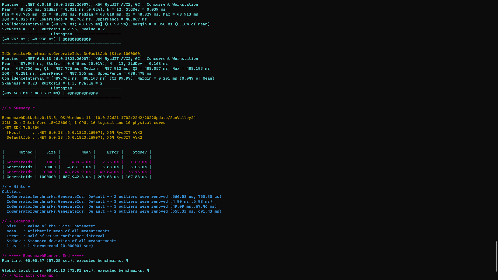

# ID GENERATOR SNOWFLAKE
IdGeneratorSnowflake is a C# library that provides a unique ID generation mechanism based on the Snowflake algorithm. It allows you to generate globally unique IDs with the ability to specify Worker ID and Datacenter ID.

### FEATURES
- Generates unique IDs based on timestamp, Worker ID, Datacenter ID, and sequence.
- Ensures uniqueness and ordering of generated IDs.
- Supports customization of Worker ID, Datacenter ID, and initial sequence value.
- Thread-safe implementation using locking for concurrent access.

### INSTALLATION
You can install the IdGeneratorSnowflake library via NuGet package manager. Run the following command in the Package Manager Console:
```
PM> NuGet\Install-Package TynabXLongkunz.IdGeneratorSnowflake
```

### USAGE
To use the IdGeneratorSnowflake library, follow these steps:

1. Create an instance of the IdGenerator class by providing the Worker ID and Datacenter ID:
    ```c#
    var idGenerator = new IdGenerator(workerId, datacenterId);
    ```
2. Generate a new unique ID by calling the NextId method:
    ```c#
    var id = idGenerator.NextId();
    ```
The generated ID will be a 64-bit unsigned integer (ulong) value.

### THREAD SAFETY
The IdGenerator class provided by IdGeneratorSnowflake is thread-safe. It utilizes locking to synchronize access to shared variables and ensure correct generation of unique IDs in a multi-threaded environment.

### LICENSE
IdGeneratorSnowflake is licensed under the MIT License.

### ACKNOWLEDGEMENTS
IdGeneratorSnowflake is inspired by the Snowflake algorithm, originally developed by Twitter.

If you have any suggestions, issues, or contributions, feel free to open an issue or pull request on the GitHub repository.

## IMAGE DEMO
<p align='center'>
</img>
</p>

## CODE DEMO
Here's an example of generating unique IDs using the IdGeneratorSnowflake library:
```c#
// Create an instance of IdGenerator with Worker ID: 1, Datacenter ID: 2
var idGenerator = new IdGenerator(1, 2);

// Generate a new unique ID
ulong id = idGenerator.NextId();

Console.WriteLine($"Generated ID: {id}");
```
